# AWS Certified Solution Architect - Associate

<!-- TOC START min:1 max:5 link:true update:true -->
- [AWS Certified Solution Architect - Associate](#aws-certified-solution-architect---associate)
  - [Introduction](#introduction)
  - [AWS Organisation](#aws-organisation)
    - [AWS Account and Physical Organisation](#aws-account-and-physical-organisation)
    - [Physical Organisation](#physical-organisation)
    - [AWS Terminology](#aws-terminology)
  - [AWS Access Management](#aws-access-management)
    - [IAM Policy](#iam-policy)
    - [IAM groups](#iam-groups)
    - [IAM Roles](#iam-roles)
      - [Role Assumption](#role-assumption)
      - [Security Token Service](#security-token-service)
      - [IAM API Keys](#iam-api-keys)
  - [AWS Networking](#aws-networking)
    - [Typical VPC screen](#typical-vpc-screen)
    - [VPC Routing Basics](#vpc-routing-basics)
    - [VPC Security](#vpc-security)
    - [VPC Workflow](#vpc-workflow)
      - [Create the VPC](#create-the-vpc)
    - [VPC Limits](#vpc-limits)
  - [Server-Based Compute Services](#server-based-compute-services)
  - [Server**less** Compute Services](#serverless-compute-services)
  - [Advanced Networking](#advanced-networking)
  - [Advanced VPC Networking](#advanced-vpc-networking)
  - [Network Troubleshooting](#network-troubleshooting)
  - [Storage Services](#storage-services)
  - [Hybrid Environments](#hybrid-environments)

<!-- TOC END -->

## Introduction

## AWS Organisation

### AWS Account and Physical Organisation

This represents how how you manage multiple services and account managment.

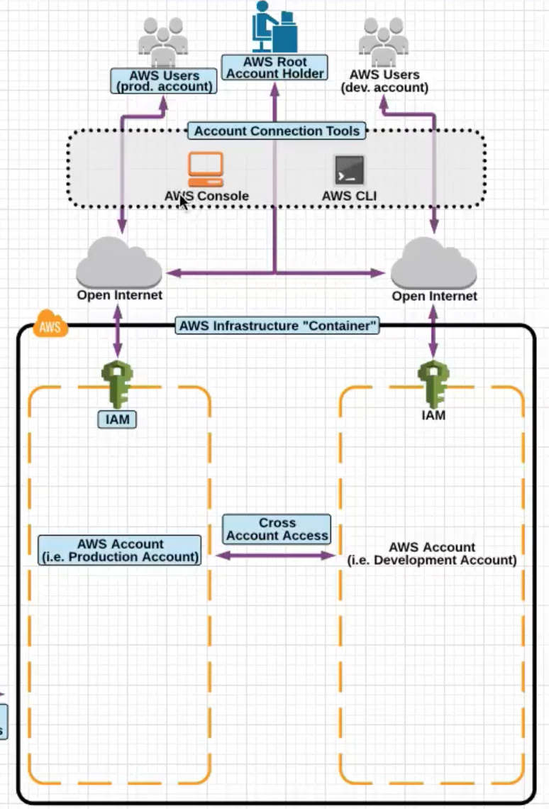

 > The above picture shows a organisation of the AWS Users and Groups and the different ways (You can have different groups for `PROD` and `QA`) , Console or CLI they can use to login and manage the AWS Cloud.

### Physical Organisation

At a very high level AWS can be broken down into two main blocks

**`AWS Regions`** : These are grouping of independenly separated datacenters in a specific geographic regions know as `Availabilty Zones`.

**`AWS Edge Location`** : It is a Datacenter whic does not contain any AWS Services ; Instead it is used to deliver contents to parts of the world. `CloudFront`

> Not All AWS Services are availaible globally , one of the example of a Global Service is the `IAM`

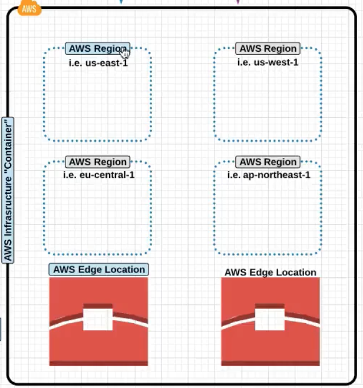

An `AWS Region` has multiple `Availabilty Zones`

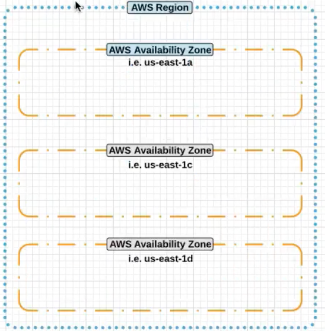

Now within each `Availabilty Zone` there can be multiple `Datacenters`

`Availabilty Zones` are **phyically sperated** to each other but **have high speed connection between them** to provide **Fault Tolerance**

> So as an example `S3` is replicated accross all `Availabilty Zones` and all `Datacenters` for **reliability and high availaibility**.

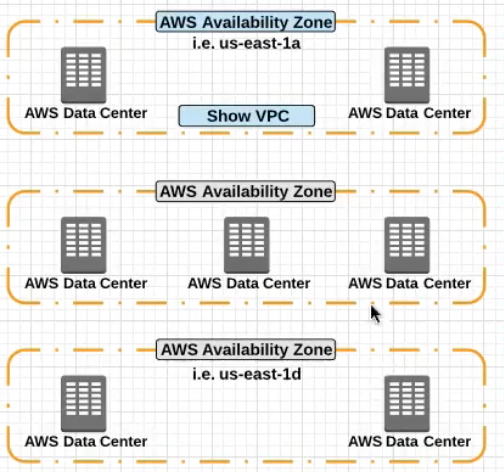

Now as we further move ahead , the `VPC` is the

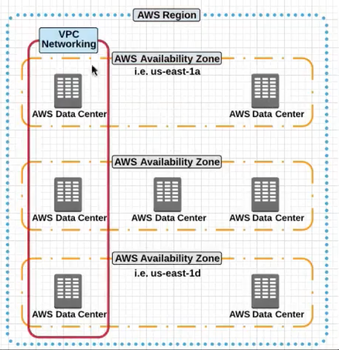

### AWS Terminology

`High Availability (HA)` This means creating and managing the ability to automatically “failover” to a secondary system if the primary system goes down for any reason as well as **eliminating all single points of failure** from your infrastructure.

`Fault Tolerance` this means infrastructure that is designed in such a way that **when one component fails**(be it hardware or software), a **backup component takes over operations immediately** so that there is no loss of service.

`Scalability` is the capability to scale out **easily**.

`Elasticity` the ability to **scale-up** as well as **scale-down**

-------

## AWS Access Management

Now lets look at the `IAM` Components where you manager Users, roles and groups, IAM Consistes of :

`IAM User`
`IAM Groups`
`IAM Policy`
`IAM Role `
`IAM API Keys`
`IAM Password Policy`

> IAM is Global and does not require a region selection.

Now once you have enable IAM , you can use the link show in the picture below to login

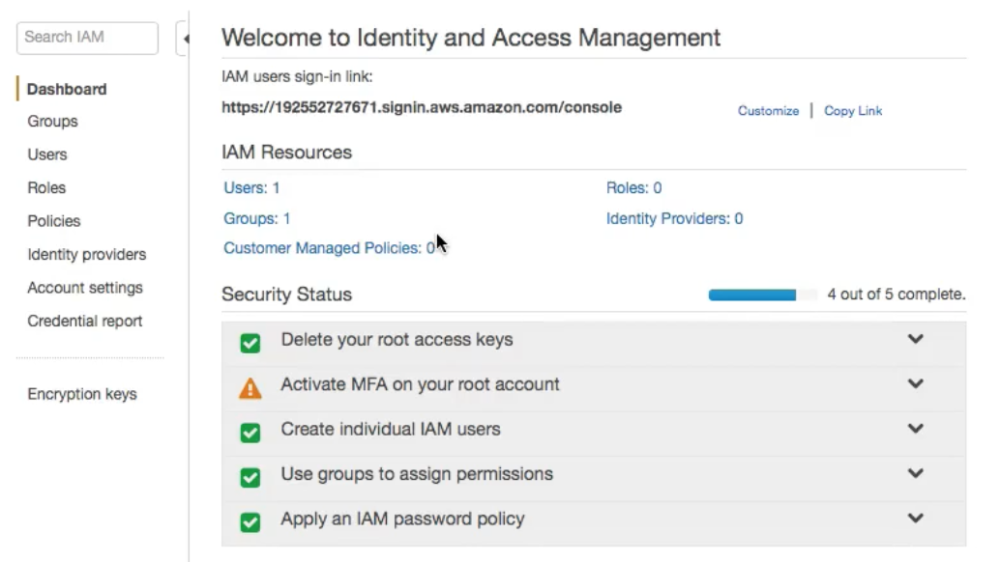

### IAM Policy

An IAM Policy , looks like this. Note that `Deny` will have a precedence over `Allow`.

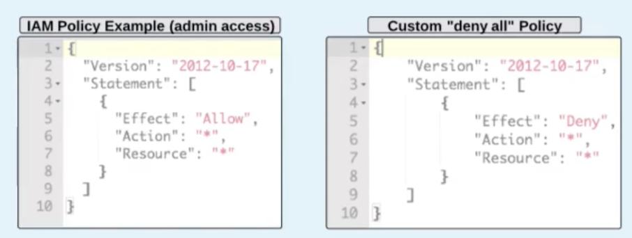

An example of where you can see the policy in detail and whats how it is organised

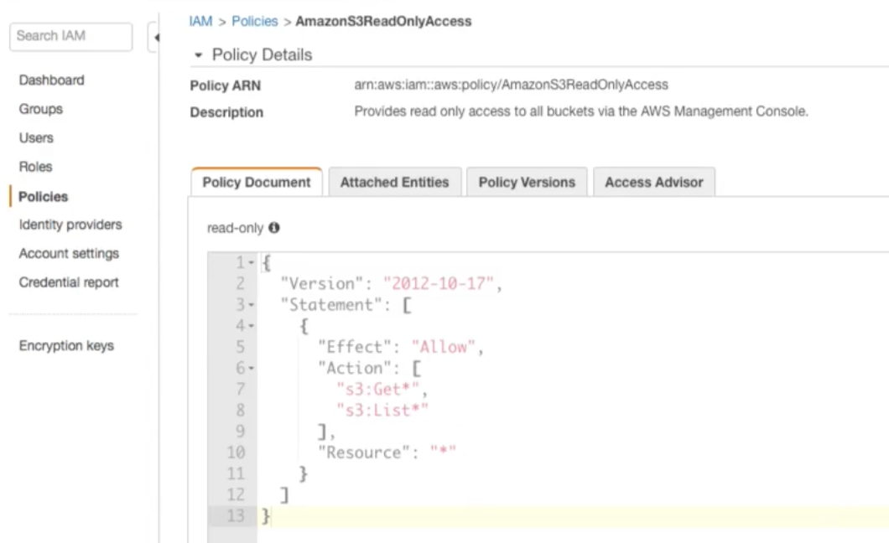

### IAM groups

Groups are like AD Groups in a company where you segregate users into respective division , like HR, Finace etc .

So now the `policies` can be attached to the `groups` directy.

### IAM Roles

Look at the example below and notice how that all the Users and Roles are created at the IAM Level.

`Non AWS Account Holder` : Now what we integrate AWS with the AD in a company. The users from AD who are **authenticated via SAML** now need to be mapped to `Role` to be able to do things in the AWS

`EC2 instance needing access to S3`

> An EC2 instance can only have one role attached to it .

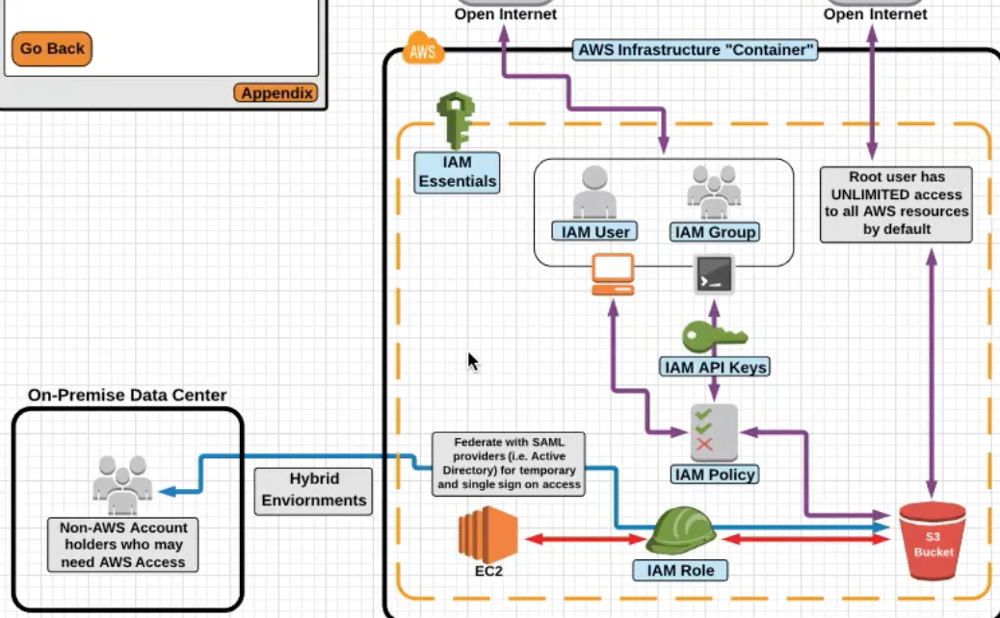

#### Role Assumption

Now lets say , the users below in the `DEV` group need access to the  resources in the `PROD`, then can **assume** a `Role` and be able to access the resource in `PROD`.

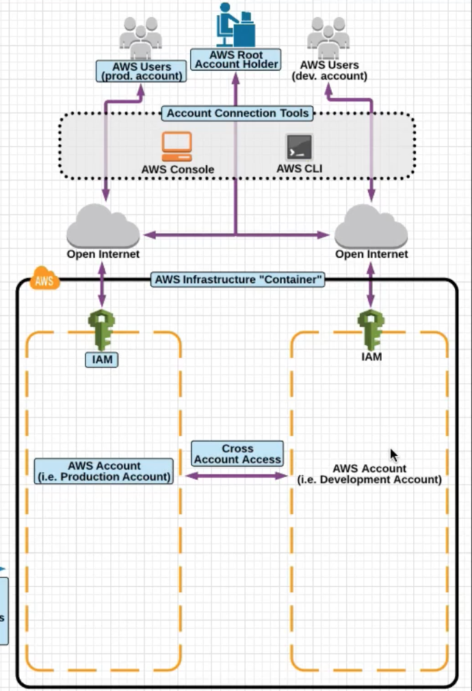

**How does the above assumption happen?**

An `IAM Policy` is attached to an `IAM Role` which is then assigned to the `User` or `Resource` which needs acces.

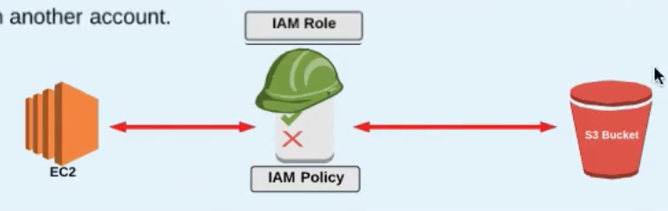

Notice in the screenshot below , we have 3 different types of Roles:

**`AWS Service Roles`** : Like EC2 accessing S3
**`Role for Cross Account access`** : Allowing access for `DEV` IAM group to `PROD`
**`Role for Identity Provider Access`** : Federation and SAML , Facebook, Google.

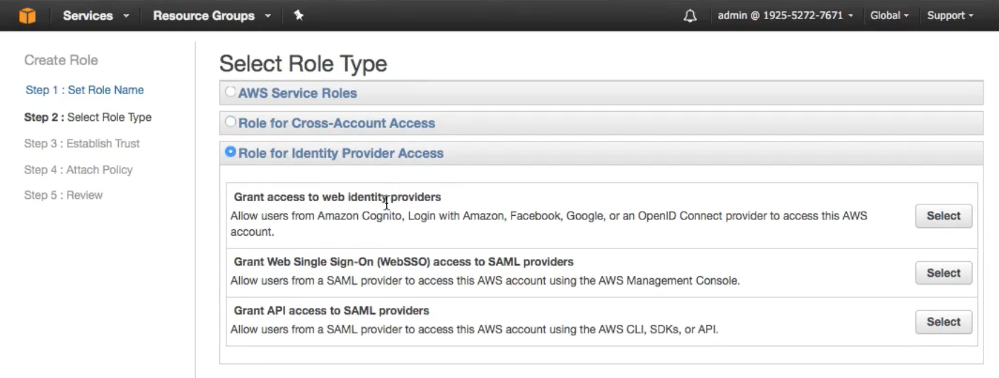

#### Security Token Service

This a temporary credetials which allows access to the AWS Resource.
So in the example of `EC2` accessing `S3` and `STS` is generated for the EC2 instance.

The benefit is that the **credetials are not required to be embedded** in the application.

STS times out / expires after certain time period.

#### IAM API Keys

These are the API Keys like openstack which enables programmatic access to the AWS APIs.

-------
## AWS Networking

> VPC `Virtual Private Cloud` is the networking is architected in the cloud.

Now lets take a deeper dive into VPC ad look it under the hood.

`VPC` spans `Avalaibility Zones` and `Multiple Datacenters`.

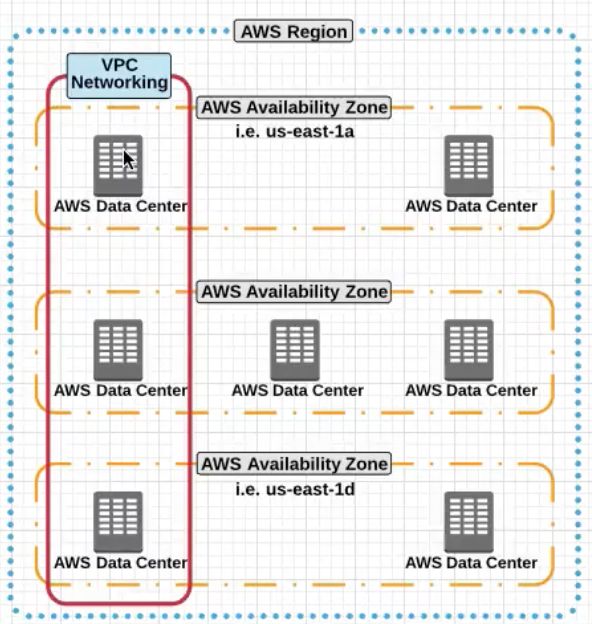

Now take a look at the picture belpw and see what the a dissection of VPC looks like internally.

 - Notice how the VPC spans the two different AZs in the picture.
 - Notice the **private subnets** e.g `172.16.0.0` spanning two different AZs. This enables you to design and put your servers in **different failure domains enabling High Avalaibility**
 - You can define custom `CIDR` in each subnet.
 - You can create routes between the Subnets.
 - You can also have subnet level firewalls and access rules.

### Typical VPC screen

Notice on the left the different networking constructs you have to work and play with :)

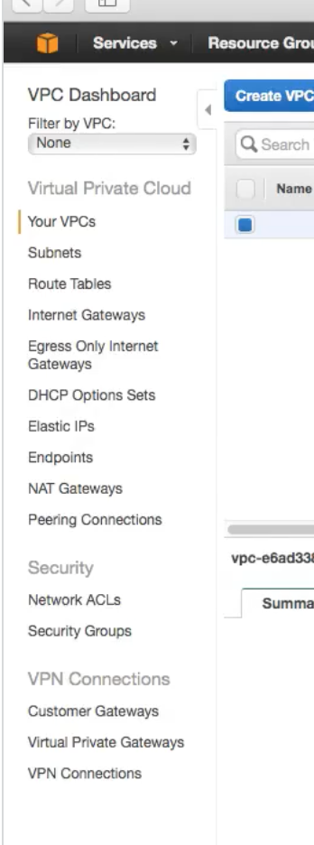

### VPC Routing Basics

Now lets take a look at a deeper level on the VPC Routing Basics the `Internet  gateway`, `Subnets` and the `Routing table`.

`Internet Gateway` : The is a default internet gateway connected to the default VPC. It is horizontally scales in the backend and there is no need to manage the bandwidth and capacity of the same. It has **built in Fault tolernace at the Amazon Networking level**.

> We dont have to manage `Internet Gateways` bandwidth, AWS Does that for us.

Again , you can only have **one Internet Gatewat attached a VPC**.
Notice the attached `Internet Gateway` to the VPC in the picture below.

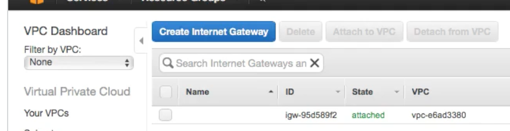

Now take a look at the `Route Table` in the picture below and how `0.0.0.0` is mapped to the `Internet Gateway` for all **outbound internet traffic**.

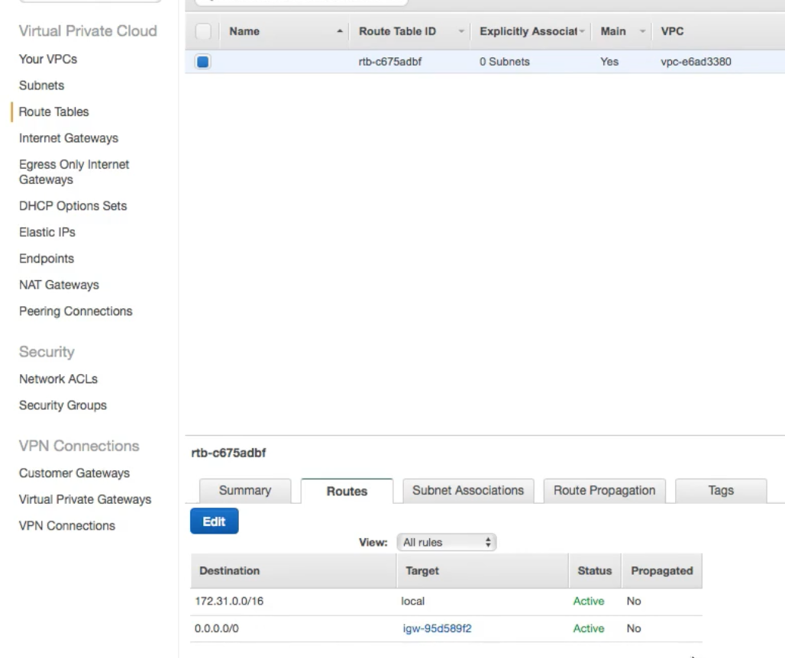

`Subnets`: After creating VPC, you can create o**ne or more subnets** in each `Availabilty Zone`. Each **subet much reside in one Availaibilty Zone** and **cannot span** different `Availability Zone`.

> So **VPC spans Availabilty Zones** but **Subnet are contained in one Availabilty Zone**.

IMPORTANT NOTE : `Subnets` are associated to `Route Tables` and the `Route Table` may or may not be attached to an `Internet Gateway`

The following association is show in the picture below .

`Subnet ---> Route Table ---> Internet Gateway`

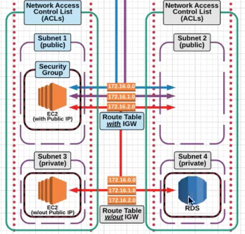

`Explicit Association` is when you move the route tables from default to the one which you created.

### VPC Security

**`Network ACLs`** `allow` or `deny` traffic at the subnet level and are stateless, which means that the return traffic had to be `ALLOWED` for traffic for both direction.

This follows at the Cisco ACL `access-list` order charecteristics.

**`Security Groups`** Just like Openstack Security groups but they are **statefull** . Security group **only supports** `allow` rules.

### VPC Workflow

#### Create the VPC

1. Create the VPC and give it a `CIDR` Block range. **Notice** that you can also define `IPv6` CIDR ranges. When `Tenancy`  is set to dedicate you are **not sharing** your servers with the other users.

2. Create the `Internet Gateway`
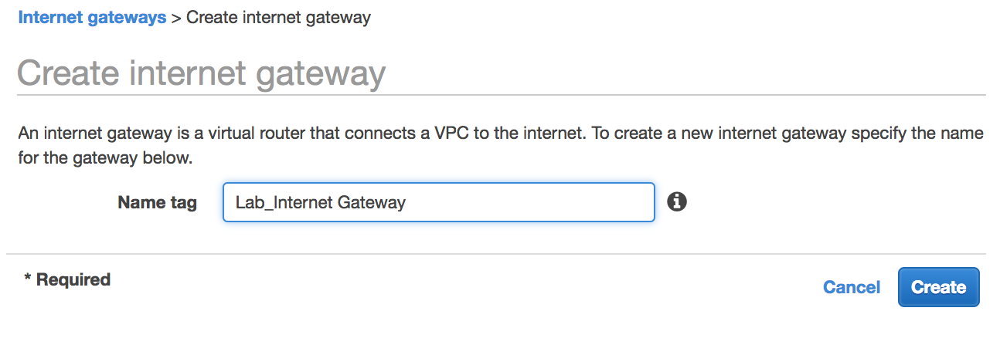
3. Attach the `Internet Gateway` to the VPC
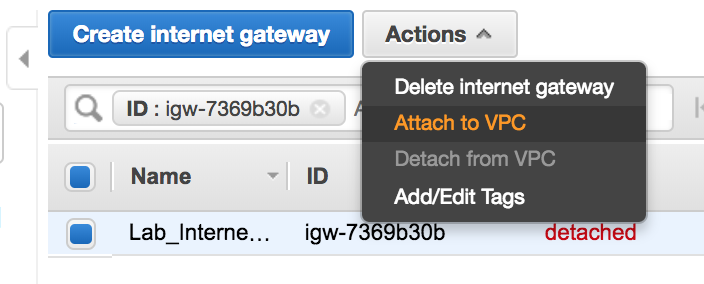
4. Next we will create **two different** `Route Tables`, one which is **connected** to the `Internet Gateway` and the other **which is not** connected.
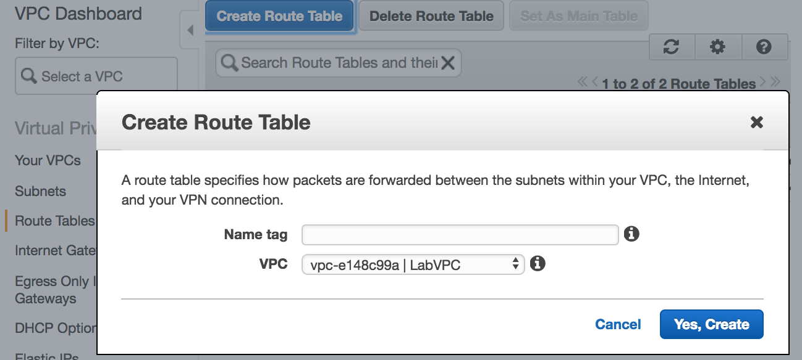
Now **connect** the `Route Table` created above to the `Internet Gateway`. If you leave the `Route Table` not connected to the `Internet Gateway` it becomes a private route table.
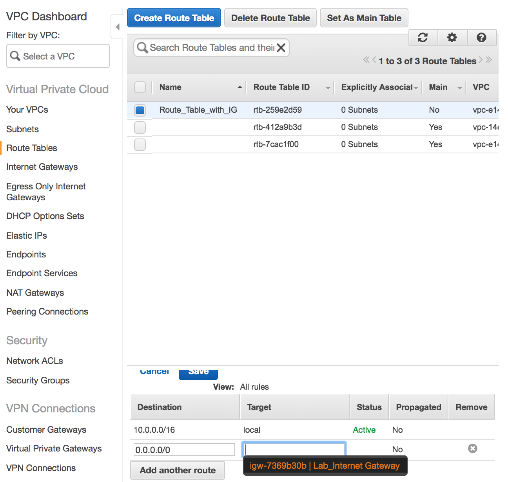
5. Now Create a `Subnet`. Notice that you have to specifically define the `Availabilty Zone` (a subnet can only span an AZ) and the `CIDR` block range which is within the range of the VPC.
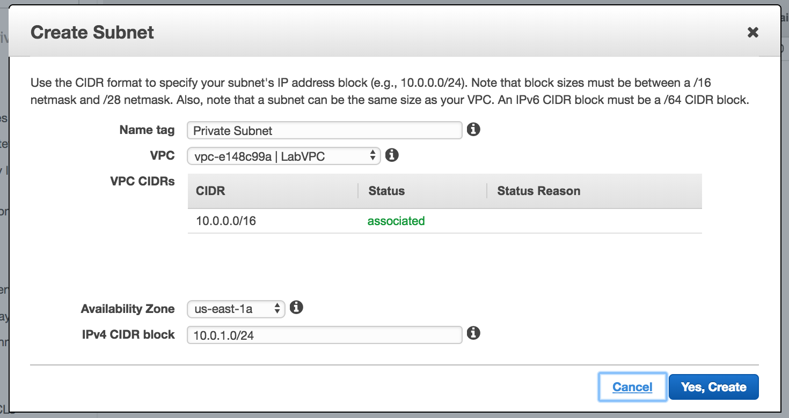
6. Now you can create the Network ACL which is a straight forward process.
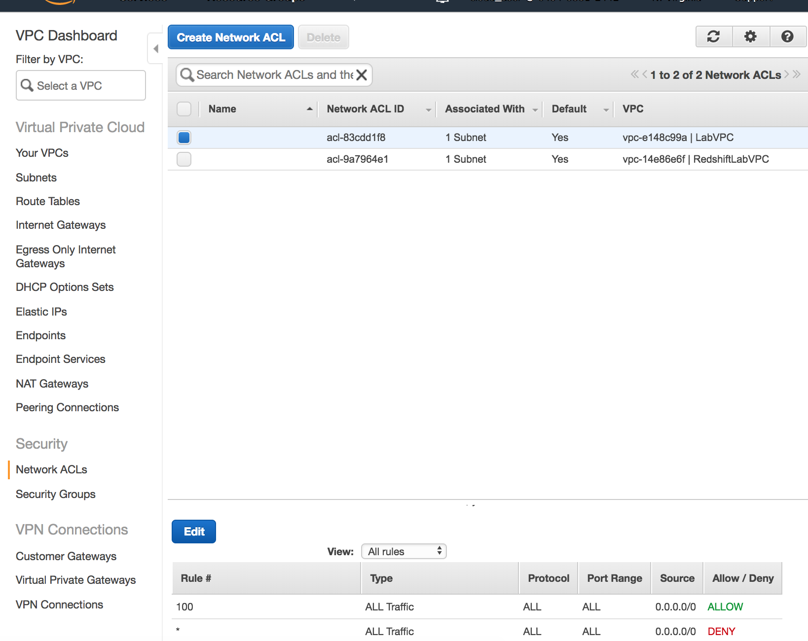

### VPC Limits

- 5 VPCs per region (you can have this increased)
- 5 Internet Gateways per region , this is equal the VPC limit as **one VPC can only have one internet gateway**.
- 50 VPN Connections per region.

-------

## Server-Based Compute Services
-------

## Server**less** Compute Services
-------

## Advanced Networking
-------

## Advanced VPC Networking
-------

## Network Troubleshooting
-------

## Storage Services
-------

## Hybrid Environments
