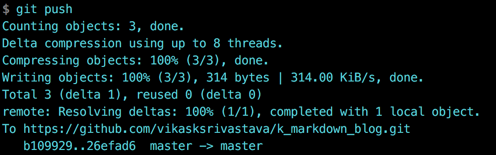

## EIGRP Notes

Cisco added some of the features from link-state routing protocols to EIGRP which makes it far more advanced than a true distance vector routing protocol like RIP. This is why (probably the marketing department) calls EIGRP an **advanced distance vector or hybrid routing protocol** .


### Link State Protocol

- Link State knows **every thing** about the network.

### Distance Vector Protocol

- Distance Vector is what the **neighbor router has told it**.

  > **RIP** is a true distance vector routing protocol and very simple:
        - No neighbor discovery. `Compare this with Hello Packets`
        - Periodic updates.
        - Vulnerable to loops. `Compare it with EIGRPs loop free logic  `
        - Simple metric (hop count). `Compare it with EIGRP K Values`

Cisco added **some of the features from link-state routing protocols to EIGRP** which makes it far more advanced than a true distance vector routing protocol like RIP. This is why (probably the marketing department) calls **EIGRP an advanced distance vector or hybrid routing protocol**.

> - EIGRP does not use broadcast packets to send information to other neighbors but will use multicast or unicast.
> - Besides IPv4 you can also use EIGRP to route IPv6 or even some older network layer protocols like IPX or AppleTalk.
> - EIGRP is **100% loop-free** and I'm going to show you why this is true.

**EIGRP Protocol Number is 8**

EIGRP runs **directly on top of the IP header**. If you look at the picture above you see we have a frame header (for example an Ethernet Frame), an IP Header (we are using IPv4) and inside the IP packet you'll find EIGRP.


> **Advertised Distance** : Is what your neigbor told you the cost to the distance is.
> **Feasible Distance** : Is what your neigbor told you plus the cost to reach the neighbor .

 So in the above example , `R3` tells `R2` that the cost to go to destination is `5` (Advertised Distance) but `R2` knows that the Feasible Distance is `5 + 4` (Actual Distance)

## Loop Free Logic


> Since `R3` told `R2` about the **destination**, `R2` will not advertise on the same link back to `R3` about its path to destination. **Split Horizon**

`Note: Considerig the cost to Reach destination from R4 is 1`

In the example above , we have the `DESTINATION` connection to the R4 router.
We are looking the topology from router `R3`'s perspective.


| Router | Advertised Distance  | Feasible Distance |
| ------  | ------ | ----- |
| R4 | 1  | 6 `(5+1)` `SUCCESSOR`
|R2   | 24  `(8+10+5+1)`  | 28 `(24+4)`
|R1   | 18 ``(8+4+5+1)``  | 28 `(18+10)`

In the example above , `Advertised Distance` is what **other routers** have told `R3` , `Feasible Distance` is what it takes `R3` to reach **other routers**.

#### Successor / Feasible Successor Selection

> **The path with the lowest FD will be selected as the `Successor`**

For `Feasible Successor` to be selected the following criteria should be fullfilled:

`Advertised Distance of Feasible Sucessor < Feasible Distance of Successor`

In the table above neither `R1` nor `R2` satisfied that criteria hence are not selected as the backup paths `Feasible Sucessor`

---------------------------------------------------------------------------

## Load Balancing

Lets take an example of the following EIGRP routing table :

| Router | Advertised Distance  | Feasible Distance | Sucessor
| ------  | ------ | ----- |----- |
| R1 | 10 | 15 |
|R2   | 5  | **10** | `SUCCESSOR`
|R3   | 9  | 109 | `FEASIBLE SUCCESSOR`

In the above example , since `R2` has lowest FD it becomes the Feasible Successor.
Now the question to ask for Feasible Successor Selection is :

`Is my Advertised Distance less than the FD of Successor ?`

Since in the above table `9` is less than FD 10 , it is selected as the FS.


---------------------------------------------------------------------------


Finally `git commit` `git push` configuration file.



## Auto Summarisation
  

With Auto Summarization , any network configured on the routers is summarised back to the subnet mask they fall under  As per the above table .

So in the above example , since 172.16 falls under /16  ; It is summarised to 172.16.0.0


```sh
R1#sh ip eigrp neighbors
EIGRP-IPv4 Neighbors for AS(100)
H   Address                 Interface              Hold Uptime   SRTT   RTO  Q  Seq
                                                   (sec)         (ms)       Cnt Num
0   192.168.1.2             Et1/3                    14 01:17:39   31   186  0  17
R1#


R1#sh ip protocols
*** IP Routing is NSF aware ***

Routing Protocol is "eigrp 100"
  Outgoing update filter list for all interfaces is not set
  Incoming update filter list for all interfaces is not set
  Default networks flagged in outgoing updates
  Default networks accepted from incoming updates
  EIGRP-IPv4 Protocol for AS(100)
    Metric weight K1=1, K2=0, K3=1, K4=0, K5=0
    NSF-aware route hold timer is 240
    Router-ID: 10.0.0.1
    Topology : 0 (base)
      Active Timer: 3 min
      Distance: internal 90 external 170
      Maximum path: 4
      Maximum hopcount 100
      Maximum metric variance 1

  Automatic Summarization: disabled
  Maximum path: 4
  Routing for Networks:
    0.0.0.0
  Routing Information Sources:
    Gateway         Distance      Last Update
    192.168.1.2           90      01:09:55
  Distance: internal 90 external 170

R1#
```
