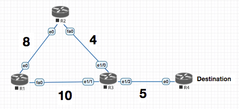
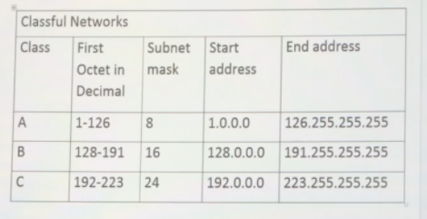
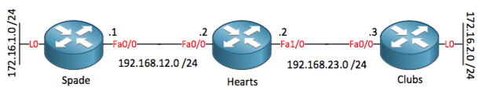
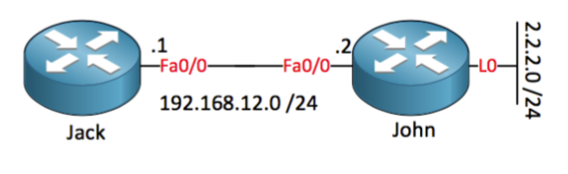

## EIGRP Notes

<!-- TOC START min:1 max:3 link:true update:true -->
  - [EIGRP Notes](#eigrp-notes)
    - [About EIGRP](#about-eigrp)
  - [Path Selection](#path-selection)
  - [Loop Free Logic](#loop-free-logic)
  - [Successor / Feasible Successor Selection](#successor--feasible-successor-selection)
  - [Load Balancing](#load-balancing)
  - [Auto Summarisation](#auto-summarisation)
  - [Passive Interface](#passive-interface)
    - [EIGRP Metrics](#eigrp-metrics)
  - [Stub Router](#stub-router)

<!-- TOC END -->

Cisco added some of the features from link-state routing protocols to EIGRP which makes it far more advanced than a true distance vector routing protocol like RIP. This is why (probably the marketing department) calls EIGRP an **advanced distance vector or hybrid routing protocol** .


> - EIGRP does not use broadcast packets to send information to other neighbors but will use multicast or unicast.
> - Besides IPv4 you can also use EIGRP to route IPv6 or even some older network layer protocols like IPX or AppleTalk.
> - EIGRP is 100% loop-free


#### Link State Protocol

- Link State knows **every thing** about the network.

#### Distance Vector Protocol

- Distance Vector is what the **neighbor router has told it**.

  > **RIP** is a true distance vector routing protocol and very simple:
        - No neighbor discovery. `Compare this with Hello Packets`
        - Periodic updates.
        - Vulnerable to loops. `Compare it with EIGRPs loop free logic  `
        - Simple metric (hop count). `Compare it with EIGRP K Values`

Cisco added **some of the features from link-state routing protocols to EIGRP** which makes it far more advanced than a true distance vector routing protocol like RIP. This is why (probably the marketing department) calls **EIGRP an advanced distance vector or hybrid routing protocol**.

> - EIGRP does not use broadcast packets to send information to other neighbors but will use multicast or unicast.
> - Besides IPv4 you can also use EIGRP to route IPv6 or even some older network layer protocols like IPX or AppleTalk.
> - EIGRP is **100% loop-free** and I'm going to show you why this is true.

### About EIGRP
EIGRP Protocol Number is `88`, EIGRP runs **directly on top of the IP header**. If you look at the picture above you see we have a frame header (for example an Ethernet Frame), an IP Header (we are using IPv4) and inside the IP packet you'll find EIGRP.

EIGRP uses **RTP (Reliable Transport Protocol)** and its function is to deliver EIGRP packets between neighbors in a reliable and ordered way. Reliability means that there is **acknowledgement for an operation , which makes it a reliable protocol**.

EIGRP has 3 tables :

`Neighbor Table` `Topology Table` `Global Routing Table`


`Hello` packets are not acknowledged since the EIGRP used a holdown time. It can use **Multicast or Unicast** for the same .  Since sending "individual" hellos to each of the routers, hence multicast is more efficient.

Different types of EIGRP Packets:

`Hello`:  These are used for neighbor discovery .
`Updates`: Updates are for sending routing information updates .
`Query`:  When the router has lost information on a certain network and does not have a back path , it send the query request.
`Reply`: Reply packets are used in response to the query packets and are reliable.
`ACK`: Acknowledgment

## Path Selection



> **Advertised Distance** : Is what your neigbor told you the cost to the distance is.
> **Feasible Distance** : Is what your neigbor told you plus the cost to reach the neighbor .

 So in the above example , `R3` tells `R2` that the cost to go to destination is `5` (Advertised Distance) but `R2` knows that the Feasible Distance is `5 + 4` (Actual Distance)

> Please note that on **Only `SUCCESSOR` is added to the route table**.

## Loop Free Logic


> Since `R3` told `R2` about the **destination**, `R2` will not advertise on the same link back to `R3` about its path to destination. **Split Horizon**

`Note: Considerig the cost to Reach destination from R4 is 1`

In the example above , we have the `DESTINATION` connection to the R4 router.
We are looking the topology from router `R3`'s perspective.


| Router | Advertised Distance  | Feasible Distance |
| ------  | ------ | ----- |
| R4 | 1  | 6 `(5+1)` `SUCCESSOR`
|R2   | 24  `(8+10+5+1)`  | 28 `(24+4)`
|R1   | 18 ``(8+4+5+1)``  | 28 `(18+10)`

In the example above , `Advertised Distance` is what **other routers** have told `R3` , `Feasible Distance` is what it takes `R3` to reach **other routers**.

## Successor / Feasible Successor Selection

> **The path with the lowest FD will be selected as the `Successor`**

For `Feasible Successor` to be selected the following criteria should be fullfilled:

`Advertised Distance of Feasible Sucessor < Feasible Distance of Successor`

In the table above neither `R1` nor `R2` satisfied that criteria hence are not selected as the backup paths `Feasible Sucessor`

## Load Balancing

Lets take an example of the following EIGRP routing table :

| Router | Advertised Distance  | Feasible Distance | Sucessor
| ------  | ------ | ----- |----- |
| R1 | 10 | 15 |
|R2   | 5  | **10** | `SUCCESSOR`
|R3   | 9  | 109 | `FEASIBLE SUCCESSOR`

In the above example , since `R2` has lowest FD it becomes the `Feasible Successor`.
Now the question to ask for Feasible Successor Selection is :

`Is my Advertised Distance less than the FD of Successor ?`

Since in the above table `9` is less than `FD` 10 , it is selected as the `FS`.

> Note that even though `R3` has a highher FD of `109` , it is selected over the `R1` which is just `15`
> This is **by design** since at the heart EIGRP is a distance vector protocol.

**Now coming back to load balancing**

In the table above

`In order to be able to do Load Balancing to the FS, the FD (total distance) should be less than SUCCESSOR x MULTIPLIER.`

So in the above example , the let say the `variance` is set to  2 which means :
Successor `10 x 2 = 20`  which is <  than `109` ; So **no load balancing**.
Again , changing the successor to `4` :
Successor `10 x4 = 40`  which is <  than `109` . So **no load balancing**.

**Finally :**
Successor `10 x10 = 100`  which is >  than `109` . **So Load balancing happens now** .


## Auto Summarisation




With Auto Summarization, any network configured on the routers is summarised back to the subnet mask they fall under as per the above table .



So in the example above , the `172.16.0.0` will be advertised by default to `Hearts` and he wouldnt know where to send the packets. `no auto-summary` under the EIGRP process will eleviate this issue.

## Passive Interface

So what do you have to do when you want to advertise a network without sending EIGRP packets on the interface and forming EIGRP neighbors? Use the `passive interface` command.


```sh
R2#show ip eigrp neighbors
EIGRP-IPv4 Neighbors for AS(100)
H   Address                 Interface              Hold Uptime   SRTT   RTO  Q  Seq
                                                   (sec)         (ms)       Cnt Num
0   192.168.1.1             Et1/2                     7 00:00:09   23   138  0  2
R2#
```

In the above table :

`Hold` : The Holddown timer
`SRTT` : Smooth Round Trip Time  , milliseconds it takes to  send an eigrp packet and receive an ack.

```sh
R2#show ip eigrp topology
EIGRP-IPv4 Topology Table for AS(100)/ID(11.11.11.11)
Codes: P - Passive, A - Active, U - Update, Q - Query, R - Reply,
       r - reply Status, s - sia Status

P 11.11.11.11/32, 1 successors, FD is 128256
        via Connected, Loopback3
P 10.0.0.0/24, 1 successors, FD is 409600
        via 192.168.1.1 (409600/128256), Ethernet1/2
P 192.168.1.0/30, 1 successors, FD is 281600
        via Connected, Ethernet1/2
P 10.0.0.1/32, 1 successors, FD is 128256
        via Connected, Loopback0
```

`PASSIVE` : Means that I have the route and I am no longer looking for it .
`Active`  Active is not good since it means we have lost information about a certain network and EIGRP doesn’t know another way of reaching this network.
`SIA Stuck in Active` : Its BAD , it means that EIGRP has not reveived a reply to a query .

`(409600/128256)` : `FD/AD`
`Ethernet1/2` : Is the interface we are using to send our packets in order to reach this network.


 **Keep in mind that the AS Numbers have to match to form neighborship**

### EIGRP Metrics

 `EIGRP Metric = 256*((K1*Bw) + (K2*Bw)/(256-Load) + K3*Delay)*(K5/(Reliability + K4)))`

 **Don’t worry** it is not used as is . The values of interest are K1,K2 ,K3,K4,K5

 - Bandwidth (`K1`)
 - Load (`K2`)
 - Delay (`K3`)
 - Reliability (`K4`)
 - MTU (`K5`)

 The `K1,K2` etc values **are not mapped** to correspoding data , for example `K1` is not 1:1 mapped with the `bandwidth`. The K values are only numbers to **scale numbers**

```sh
 R2#show ip protocols
 *** IP Routing is NSF aware ***

 Routing Protocol is "eigrp 100"
   Outgoing update filter list for all interfaces is not set
   Incoming update filter list for all interfaces is not set
   Default networks flagged in outgoing updates
   Default networks accepted from incoming updates
   EIGRP-IPv4 Protocol for AS(100)
     Metric weight K1=1, K2=0, K3=1, K4=0, K5=0
     NSF-aware route hold timer is 240
     Router-ID: 11.11.11.11
     Topology : 0 (base)
       Active Timer: 3 min
       Distance: internal 90 external 170
       Maximum path: 4
       Maximum hopcount 100
       Maximum metric variance 1

   Automatic Summarization: disabled
   Maximum path: 4
   Routing for Networks:
     11.11.11.11/32
     0.0.0.0
   Routing Information Sources:
     Gateway         Distance      Last Update
     192.168.1.1           90      00:10:03
   Distance: internal 90 external 170
```

 **By default only `K1` and `K3` are enabled and we don’t use `K2` or `K4`. This means that only bandwidth and delay are used in the formula.**

  > **Why not?** Because loading and reliability are dynamic values and they can change over time. You don’t want your EIGRP routers calculating 24/7 and sending updates


#### Bandwidth (K1)

```sh
 R2#show interfaces e1/2 | inc BW
 MTU 1500 bytes, BW 10000 Kbit/sec, DLY 1000 usec,
```

 You can tweak it using the `bandwith ` command for the interface.

#### Load (K2)

```sh
R2#show interfaces e1/2 | inc load
reliability 255/255, txload 1/255, rxload 1/255
```

#### Delay (K3)

```sh
R2#show interfaces e1/2 | inc DLY
MTU 1500 bytes, BW 10000 Kbit/sec, DLY 1000 usec,
```
 Can be tweaked by `delay` command at the interface level

#### Reliability (K4)

```sh
R2#show interfaces e1/2 | inc relia
reliability 255/255, txload 1/255, rxload 1/255
```

 Reliability at 255/255 is 100%. This means that you don’t have issues on the physical or data-link layer.


#### MTU (K5)
```sh
 R2#show interfaces e1/2 | inc MTU
   MTU 1500 bytes, BW 10000 Kbit/sec, DLY 1000 usec,
```

 Since only `K1` and `K3` are enabled we can simplify the EIGRP formula:

  `> Metric = bandwidth (slowest link) + delay (sum of delays)`

Which further expands to:

  `> Metric = (107 / slowest link bandwidth) * 256 + (sum of delays of the path) * 256`

  > The metrics in EIGRP are a pain to work with since the values are so LARGE! If you want to practice with EIGRP you can try to disable all the K-values except K3. This will make EIGRP only use delay as metric.


 ### EIGRP Scalability Issues

 EIGRP is designed for large enterprise networks but having one big EIGRP network **(5000+ prefixes and many hops) can lead to some problems**:
- **Lots of EIGRP prefixes** equal a large topology table and routing table.
- **Calculating the successor router will take longer** if you have many EIGRP neighbors
and different paths.
- If there are many backup paths EIGRP will have to see if there are 1 or more feasible
successors, this will take longer.
- More information means our EIGRP routers have to work **harder to process**
everything.
- **When EIGRP loses a route and there is no feasible successor the route will go from passive to active and the router starts sending queries to its neighbors**.
- EIGRP sends queries on all interfaces except the interface of the successor.


## Stub Router

   > An EIGRP router that is configured as a stub does not receive queries when one of its neighbors loses a network.



In the above example when you make `Jack` the stub router ,  when lo0 (2.2.2.0) goes down it will send out a `QUERY`
But John will not send any query to Jack because it knows that it is a Stub router .

 > When we say a switch is a Stub EIGRP Switch , it means that the Switch will learn  the information about others in the network , but no it will not be able to advertise what it knows as John will not be able to send `QUERY` to it .


 ### How to see if a router is Stub or not :

  >  In the example below , it means that the stub is Adverstising **CONNECTED SUMMARY** routes

```sh
 EIGRP-IPv4 Neighbors for AS(100)
 H   Address                 Interface              Hold Uptime   SRTT   RTO  Q  Seq
                                                    (sec)         (ms)       Cnt Num
 0   192.168.1.1             Et1/2                    10 00:06:33   16   100  0  5
    Version 11.0/2.0, Retrans: 0, Retries: 0, Prefixes: 1
    Topology-ids from peer - 0
    Stub Peer Advertising (CONNECTED SUMMARY ) Routes
    Suppressing queries
```

  >  In the example below , it means that the stub is a receive only neighbour

```sh
 EIGRP-IPv4 Neighbors for AS(100)
 H   Address                 Interface              Hold Uptime   SRTT   RTO  Q  Seq
                                                    (sec)         (ms)       Cnt Num
 0   192.168.1.1             Et1/2                    14 00:00:27   12   100  0  10
    Version 11.0/2.0, Retrans: 0, Retries: 0
    Topology-ids from peer - 0
    Receive-Only Peer Advertising (No) Routes
    Suppressing queries
```

 So basically , you can be learning routes from the network as an update , but NO one will ask you (The Stub) for routes.


 **Different types of Stub Options**

```sh
 R1(config-router)#eigrp stub ?
   connected      Do advertise connected routes
   leak-map       Allow dynamic prefixes based on the leak-map
   receive-only   Set receive only neighbor
   redistributed  Do advertise redistributed routes
   static         Do advertise static routes
   summary        Do advertise summary routes
   <cr>
```

 ### Name EIGRP Instance , Example

```sh
 R1(config)#router eigrp HELLO_WORLD
 R1(config-router)#address-family ipv4 autonomous-system 333
 R1(config-router-af)#network 2.2.2.2 0.0.0.0
 R1(config-router-af)#
```


```sh
 R2#debug eigrp packets ?
   SIAquery  EIGRP SIA-Query packets
   SIAreply  EIGRP SIA-Reply packets
   ack       EIGRP ack packets
   all       Display all EIGRP packets
   hello     EIGRP hello packets
   query     EIGRP query packets
   reply     EIGRP reply packets
   request   EIGRP request packets
   retry     EIGRP retransmissions
   stub      EIGRP stub packets
   terse     Display all EIGRP packets except Hellos
   update    EIGRP update packets
   <cr>

```

```sh

 R2#clear ip eigrp neighbors
 R2#
 Show up eigrp neighbours
 Show ip protocol
```

```sh
 R2#show ip protocols
 *** IP Routing is NSF aware ***

 Routing Protocol is "eigrp 100"
   Outgoing update filter list for all interfaces is not set
   Incoming update filter list for all interfaces is not set
   Default networks flagged in outgoing updates
   Default networks accepted from incoming updates
   EIGRP-IPv4 Protocol for AS(100)
     Metric weight K1=1, K2=0, K3=1, K4=0, K5=0
     NSF-aware route hold timer is 240
     Router-ID: 11.11.11.11
     Topology : 0 (base)
       Active Timer: 3 min
       Distance: internal 90 external 170
       Maximum path: 4
       Maximum hopcount 100
       Maximum metric variance 1

   Automatic Summarization: disabled
   Maximum path: 4
   Routing for Networks:
     11.11.11.11/32
     0.0.0.0
   Routing Information Sources:
     Gateway         Distance      Last Update
   Distance: internal 90 external 170


 R2#show ip eigrp topology
 EIGRP-IPv4 Topology Table for AS(100)/ID(11.11.11.11)
 Codes: P - Passive, A - Active, U - Update, Q - Query, R - Reply,
        r - reply Status, s - sia Status

 P 11.11.11.11/32, 1 successors, FD is 128256
         via Connected, Loopback3
 P 10.0.0.0/24, 1 successors, FD is 409600
         via 192.168.1.1 (409600/128256), Ethernet1/2
 P 192.168.1.0/30, 1 successors, FD is 281600
         via Connected, Ethernet1/2
 P 10.0.0.1/32, 1 successors, FD is 128256
         via Connected, Loopback0

 R2#
```


 ### How to Debug Interesting Packet :

```sh
 Jack(config)# access-list 100 permit ip any 192.168.200.20 0.0.0.0
 Jack(config)#exit
 Jack# debug ip packet 100
 IP packet debugging is on for access list 100
```


-------------------------------


Finally `git commit` `git push` configuration file.
